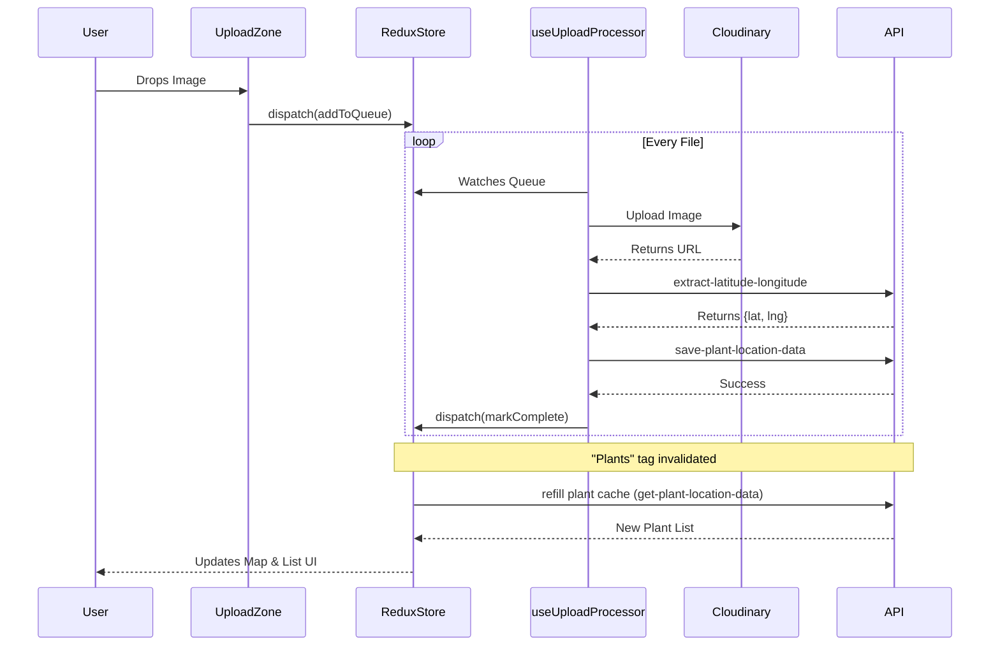

# GeoTag Farm – Visualize Plant Locations

A production-grade React + TypeScript application for farmers to visualize plant locations using geo-tagged images.

## Features
- **User Identification**: Simple email-based login.
- **Image Upload**: Drag & Drop interface with Cloudinary integration.
- **Auto-GPS Extraction**: Automatically extracts GPS coordinates via backend API.
- **Interactive Map**: Visualize plant locations on a Leaflet map.
- **Dashboard**: Integrated view with list and map modes, sorting, and filtering.

## Tech Stack
- **Frontend**: React 18, TypeScript, Vite
- **State Management**: Redux Toolkit (Global Store), RTK Query (Data Fetching/Caching)
- **Styling**: Tailwind CSS
- **Maps**: React Leaflet
- **Services**: Cloudinary (Image Hosting), Custom Backend (GPS Extraction)

---

## Architecture Decisions

### 1. Redux Toolkit & RTK Query
We chose **Redux Toolkit** for predictable global state management, specifically for:
- `userSlice`: managing authentication state.
- `uiSlice`: managing view modes (List vs Map) and sorting preferences globally.
- `uploadSlice`: handling the complex state of file uploads (queueing, progress tracking, error handling).

**RTK Query** (`plantApi`) is used for all server interactions to benefit from:
- Automatic caching and invalidation (e.g., re-fetching plant list after a successful save).
- Simplified loading/error states.
- Clean separation of API logic from UI components.

### 2. Custom Base Query Setup
To handle API quirks gracefully, we implemented a `customBaseQuery` in `plantApi.ts`.
- **Problem**: The `get-plant-location-data` endpoint returns a 404 status when a user has zero plants, which RTK Query normally treats as an error.
- **Solution**: The interceptor catches 404s specifically for this endpoint and transforms them into a successful response with an empty array `[]`. This prevents the UI from showing an error state for new users.

### 3. Upload Pipeline (`useUploadProcessor`)
Uploads are handled via a dedicated hook that watches the Redux `uploadQueue`. It ensures a sequential flow:
1. **Upload**: Image sent to Cloudinary.
2. **Extract**: Image URL sent to backend to get GPS (Lat/Lng).
3. **Save**: Metadata sent to backend to persist the plant record.

---

## Component Hierarchy

```mermaid
graph TD
    App --> Layout
    Layout --> Navbar
    Layout --> Footer
    App --> LoginPage
    App --> DashboardPage
    
    DashboardPage --> UploadSection
    DashboardPage --> VisualizationSection
    
    UploadSection --> UploadZone[UploadZone (Dropzone)]
    UploadSection --> UploadList[UploadList (Progress Bars)]
    
    VisualizationSection --> DashboardControls[Search & Filter Controls]
    VisualizationSection --> FarmMap[FarmMap (Leaflet)]
    VisualizationSection --> PlantList[PlantList (Grid View)]
```

---

## State Management Flow

### Upload & Sync Flow
This diagram illustrates how data flows from user action to server and back to the UI.



---

## API Integration Approach

The application connects to `https://api.alumnx.com/api/hackathons/`.

| Endpoint | Method | Purpose |
|----------|--------|---------|
| `extract-latitude-longitude` | POST | Parses the uploaded image to find Exif GPS data. |
| `save-plant-location-data` | POST | Saves the confirmed plant record (Image URL + Coords) to the database. |
| `get-plant-location-data` | POST | Fetches all plants associated with the user's email. |

**Key Integration details**:
- **Tag-based Invalidation**: The `savePlant` mutation invalidates the `['Plants']` tag, automatically triggering `getPlants` to refresh the UI without manual state updates.
- **Polling**: As a backup, `useGetPlantsQuery` polls every 30 seconds to ensure data consistency.

---

## Challenges & Solutions

### 1. Redux Serializability Warnings
**Challenge**: We initially stored raw `File` objects in the Redux store's upload queue. Redux Toolkit warns against putting non-serializable data (like Files) in the store because it breaks debugging features like time-travel.
**Solution**: We ignored these specific paths (`payload.file`, `upload.queue.file`) in the `middleware` configuration in `store.ts`. While usually avoided, for file uploads it is a pragmatic trade-off to keep the upload state centralized.

### 2. Map Re-rendering
**Challenge**: Leaflet maps can be tricky with React strict mode, sometimes initializing twice or losing focus when data updates.
**Solution**: We keyed the `MapContainer` with the number of plants or a specific ID to ensure it cleanly updates when new data arrives, and restricted map interactions to when data is fully loaded.

### 3. Handling 404 as "Empty"
**Challenge**: The backend design returns HTTP 404 for "No Data Found", which is technically an error code for HTTP clients.
**Solution**: Implemented `.transformResponse` and a custom base query wrapper to detect this specific condition and return a clean empty array, preventing "Request Failed" toasts for valid new users.

---

## Setup & Run

1. **Install Dependencies**
   ```bash
   npm install
   ```

2. **Environment Variables**
   Create `.env`:
   ```
   VITE_CLOUDINARY_CLOUD_NAME=...
   VITE_CLOUDINARY_UPLOAD_PRESET=...
   ```

3. **Run**
   ```bash
   npm run dev
   ```
